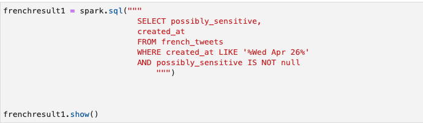
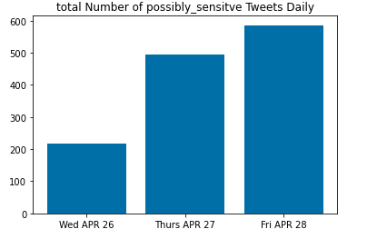
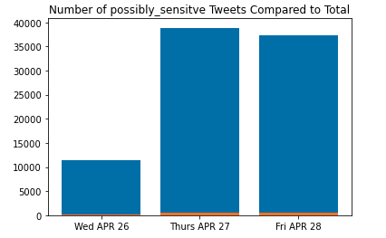
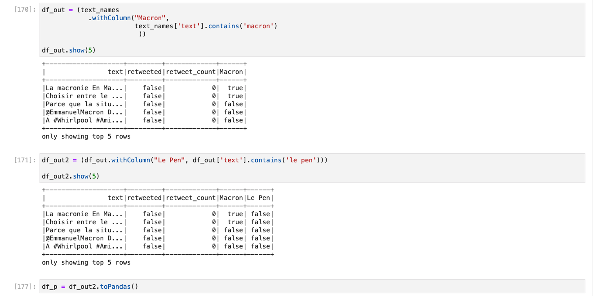
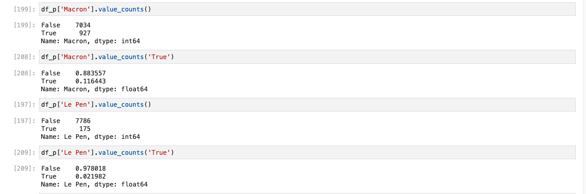
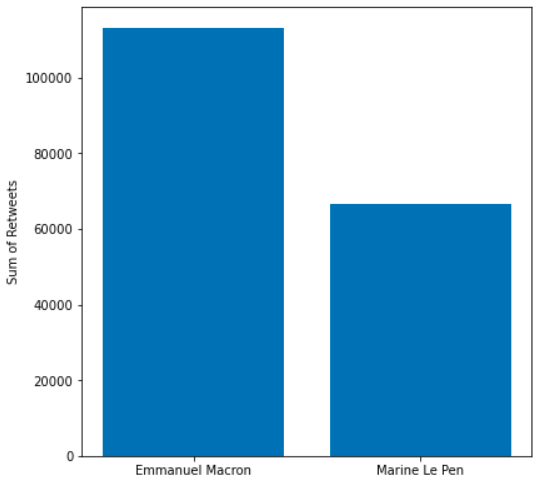
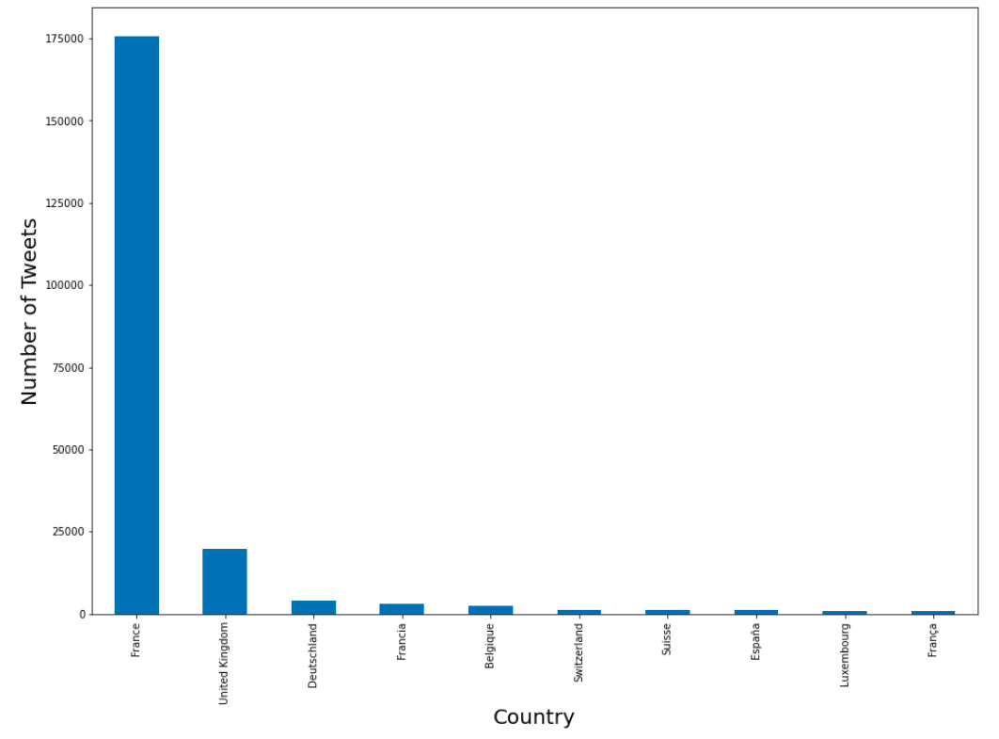

# Spark Case Study

## Goals:

* To look into the activity on tweets in relation to the potentially sensitive flags as well as mentions of the candidates within the content of the tweets

## Visualizations:

First a spark.sql query was ran to get information on potentially sensitive tweets:

One of the first thing that interested us in the data is the potenially_sensitve label that a portion of the tweets tagged True:

We took a look at the Tweets over From Wed 26 to Fri 29 of 2017, you'll notice the y-axis is much larger in this screenshot below:

Another thing that we looked into was the presence of the candidates names within the text of the tweets:

Then to get a look at the amount of retweets per candidate:

Shown in a graph

And which countries had the most tweets in the dataset:

## Potential future ideas

* A look into potentially sensitive retweets/favorites over time
* Using the coordinates to map out where the tweets were coming from
